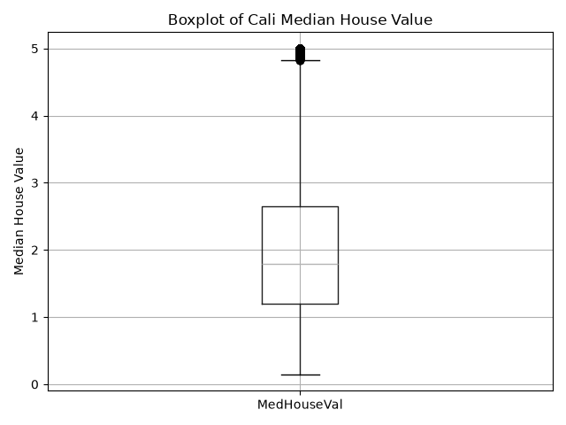

# A01: California Housing Boxplot
This project uses Python to explore the California Housing dataset and create a boxplot of median house values.

## Data
The project uses the California Housing dataset provided by the scikit-learn Python library. The dataset contains housing-related variables such as median income, house age, population, location, and median house value.

## How to Run
This project uses Python 3.11.

Install the required packages:

python -m pip install -r requirements.txt

Run the script from the main A01 folder:

python src/boxplot.py

## Expected Output
The script displays a preview of the dataset in the terminal and saves a boxplot of MedHouseVal at:

